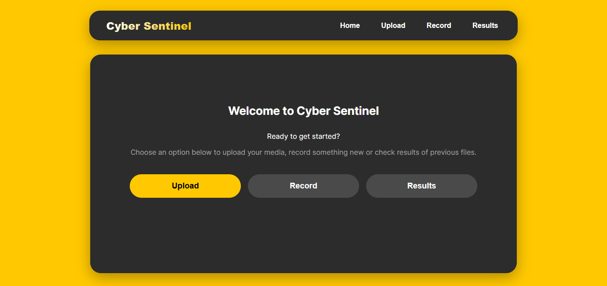
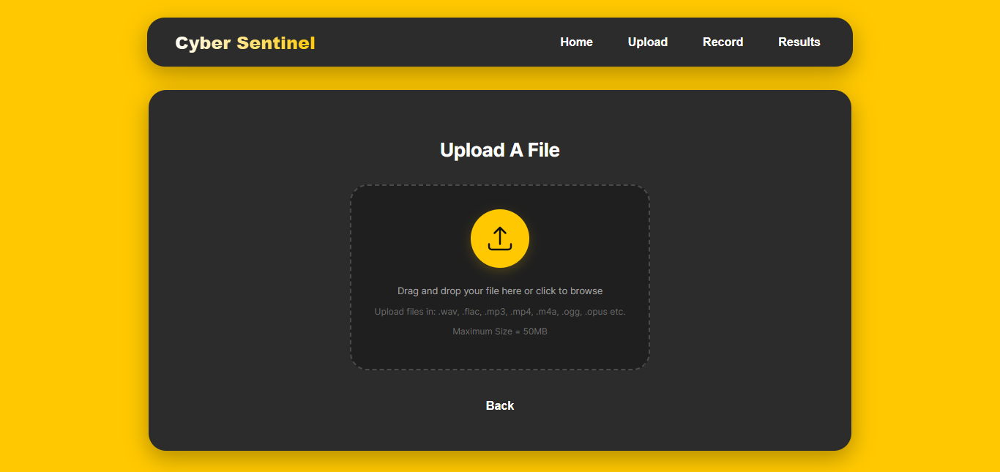
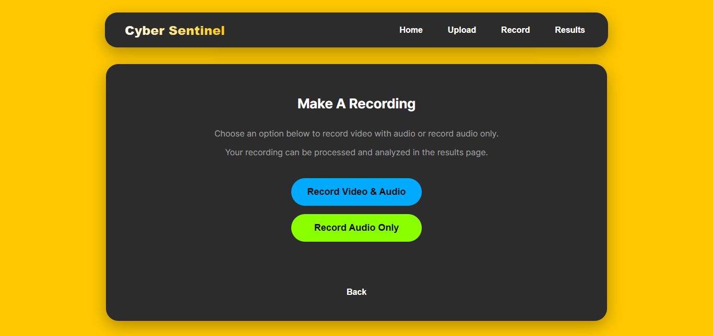
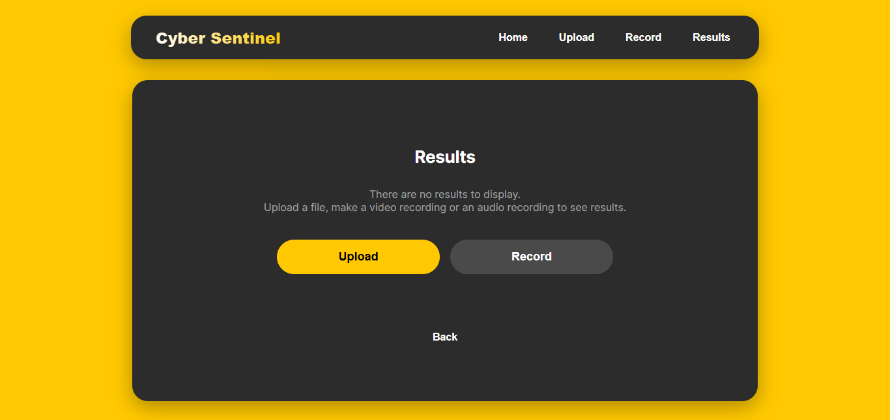

# C.S. App
This is a React application that demonstrates routing, file validation, and media recording features. It is built to be a simple, self-contained starting point for your larger project.

## Features
* Client-side Routing: Uses `useState` to switch between different "pages" without a page reload.

* File Upload Validation: Checks for valid file types `(.wav, .flac, etc.)` and size limits (50KB to 50MB).

* Media Recording: Includes buttons to trigger permission requests for both audio-only and video+audio recording.

* State Management: Utilizes React's `Context API` for simple, shared state.

## How to use this code
1.  Download the code file from github or use Git Desktop to open the code file
2.  Create a new React project using `npx create-react-app my-app` or a similar tool.
3.  Navigate to the `src` folder in your project.
4.  Replace the contents of your `App.jsx` with the code from the generated file; and other files.
5.  Run `npm start` to see the application in your browser.
